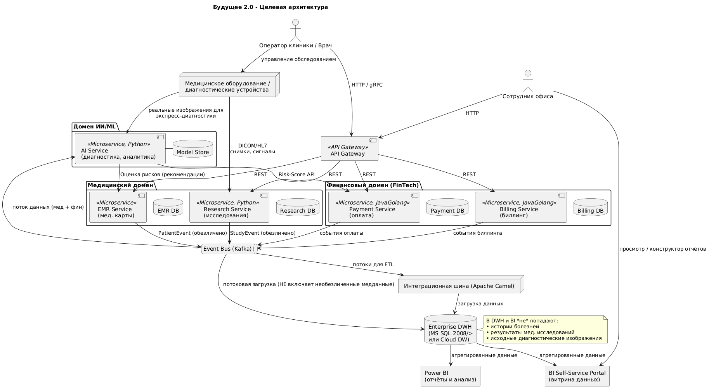

# Архитектурное решение для «Будущее 2.0»

### Целевая микросервисная архитектура (C4-диаграмма контейнеров)

Целевая архитектура системы через год основана на **микросервисном подходе**. Это означает, что вместо единого монолитного приложения функциональность разделена на независимые сервисы по доменам (областям бизнеса). Каждый микросервис отвечает за свой участок логики, имеет собственную базу данных и общается с другими сервисами через чётко определённые API или асинхронные сообщения. Ниже представлена диаграмма контейнеров (уровень C4) с основными компонентами целевой архитектуры:

**Описание архитектуры:** Пользователи взаимодействуют с системой через единую точку входа – **API Gateway**, который распределяет запросы к соответствующим сервисам. В **финансовом домене** (FinTech) находятся сервисы, связанные с оплатами и биллингом; они написаны на Java/Golang, автономно выполняют свою бизнес-логику и хранят данные в своих базах (`Payment DB`, `Billing DB`). В **медицинском домене** сосредоточены сервисы управления медицинскими картами (EMR) и научными/медицинскими исследованиями – они изолированы в отдельные сервисы (`EMR Service` и `Research Service`), каждый со своей базой данных. **Домен ИИ/ML** включает интеллектуальные сервисы (на Python) для анализа данных и машинного обучения – например, `AI Service` выполняет прогнозы или расчёты на основе данных, хранящихся в хранилище моделей (`Model Store`).

Для обмена данными и интеграции используется асинхронная **шина сообщений (Event Bus)** на базе Apache Kafka. Все ключевые события (финансовые транзакции, обновления медданных, результаты исследований и т.д.) публикуются соответствующими микросервисами в Kafka в виде **доменных событий**. Это обеспечивает слабую связанность: сервисы других доменов могут при необходимости подписываться на эти события, не вызывая напрямую чужие базы. Например, сервисы домена ИИ получают поток обезличенных данных из медицинского домена через Kafka и могут сразу проводить аналитику в режиме реального времени. Такой **событийно-ориентированный подход** позволяет **сильно снизить связность между сервисами**, сделать взаимодействие асинхронным и масштабируемым.

**Интеграционная шина Apache Camel** продолжает использоваться для тех сценариев, где нужен форматно-логический обмен или сложные маршрутизации (например, для связи с legacy-системами или внешними сервисами). Однако роль Camel в новой архитектуре сведена к минимуму: основные внутренние взаимодействия реализуются через прямые REST API вызовы (для синхронных запросов, через API Gateway) либо через событийную шину Kafka (для асинхронной интеграции). Camel, по сути, становится одним из микросервисов-интеграторов, а не центральным узким местом.

**Хранилище данных (DWH)** по-прежнему присутствует, но **используется только для аналитики и отчетности**. В перспективной архитектуре данные из доменных микросервисов поступают в DWH через ETL/стриминг (например, с помощью Apache Camel или Kafka Connect), **но новая бизнес-логика больше не реализуется на уровне DWH**. DWH (на текущий момент MS SQL Server 2008) планируется обновить до современной версии или перенести в облачный DWH. Инструмент BI (Power BI) подключается к DWH и формирует отчёты и дашборды. Таким образом, DWH функционирует строго как **витрина для аналитики**, что соответствует принципам DDD, где **хранилище данных рассматривается лишь как элемент для отчетности, а не как источник бизнес-логики**.

## Self-Service BI‑портал (витрина данных)

В архитектуру включается отдельный портал для self-service BI (визуальная **витрина данных**), предоставляющий нетехническим пользователям возможности самостоятельной аналитики. Ключевые функции портала:

* **Визуальный конструктор отчетов** – drag\&drop интерфейс для построения отчетов и дашбордов по заданным метрикам.
* **Шаблоны отчетов** – возможность сохранять и тиражировать наработанные отчеты.
* **Настройка прав доступа** – гибкая модель ролей и прав, регулирующая, кто и какие данные может видеть/менять.

При этом *явно исключаются* из BI‑портала все чувствительные медицинские данные: медицинские карты, истории болезней, результаты исследований и т.п. Это позволяет предотвратить утечки личной информации и соблюсти требования конфиденциальности (HIPAA/GDPR). Вся обработка медицинских данных выполняется в прикладных сервисах домена, а в витрину попадают только агрегированные обезличенные показатели. Важно, чтобы в BI‑портале хранились лишь обобщенные данные (напр., статистика по обращаемости, оплатам, KPI) – во избежание нарушений безопасности. Централизованное управление данными и доступом в BI требует внедрения строгой политики governance: без четких правил (контроль доступа, аудит, стандарты построения отчетов) возрастает риск некорректной или несанкционированной публикации информации.

## Точки взаимодействия: головной офис и клиники

Головной офис и филиалы (клиники) рассматриваются как внешние узлы системы. Операторы в этих точках вводят и получают данные через клиентские интерфейсы (веб‑приложения или терминалы), которые подключаются к центральной системе через API‑шлюз. Потоки данных идут в оба направления: от клиник и офиса в центральную систему для хранения и анализа, и обратно – например, обновленные отчеты или уведомления возвращаются пользователю. Передача данных может реализоваться по разным схемам: через REST‑API сервисов доменов или через событийную шину (event-driven). При изменении данных в сервисе генерируется событие, которое подписанные сервисы и аналитические модули обрабатывают асинхронно. Кроме того используется централизованное хранилище (DWH) – данные из разных сервисов выгружаются через ETL-процессы для консолидации и аналитики. При этом в DWH хранятся только сырые факты и агрегаты – никакой бизнес‑логики в нем не заложено. Все правила вычислений и валидации осуществляют сами микросервисы доменов, а DWH служит лишь для отчётности и BI.

## Безопасность данных и чистота архитектуры

Архитектура учитывает строгие требования безопасности и конфиденциальности. **Транспорт:** весь сетевой трафик идёт по защищенным каналам (HTTPS/TLS), шифруются как передачи, так и бэкапы данных. **Хранение:** базы данных сервисов и DWH шифруются в состоянии «at rest», используются технологии динамического маскирования полей. **Аутентификация и авторизация:** внедрена многофакторная аутентификация (MFA) для администраторов и операторов, а также детальная система ролей и прав (RBAC). Доступ к витрине данных и отчетам регулируется ролями: не все пользователи видят одну и ту же информацию. Гранулированное разграничение (row/column level security) позволяет скрывать конфиденциальные поля даже внутри сервисов и репортов. **Мониторинг и аудит:** все действия записываются в логи, проводится постоянный анализ на предмет угроз и аномалий. Архитектура проектируется с учётом нормативов (например, ISO 27001, HIPAA, GDPR): каждый компонент соответствует требованиям по защите персональных данных.

Специально для BI‑портала разработаны дополнительные ограничения: там вообще отсутствуют исходные медицинские данные пользователей. Это снижает риск раскрытия персональных данных даже в случае компрометации аналитики. Таким образом, комбинируются принципы «defense-in-depth»: сетевое разделение, криптография, контроль доступа и изоляция сервисов.

