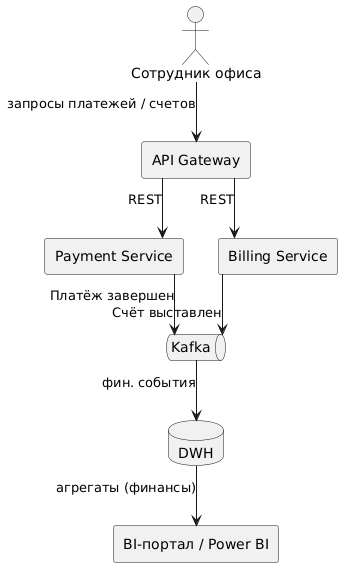
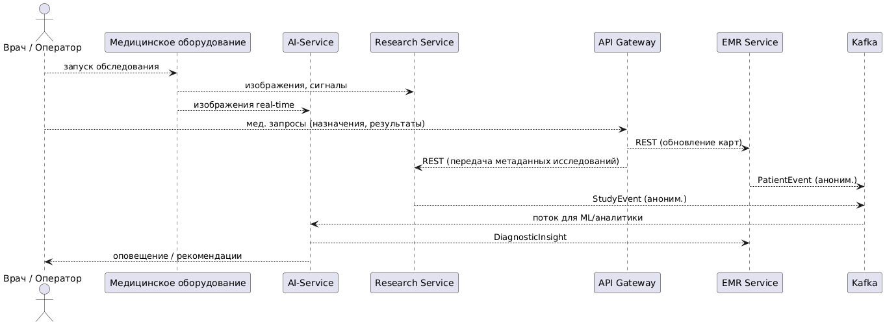
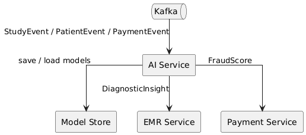
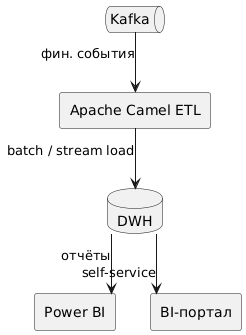

### 1. Декомпозиция системы на независимые домены

Чтобы новая логика не писалась в DWH и каждая команда могла развивать свой участок системы, предлагается разделить платформу «Будущее 2.0» на **несколько независимых доменов** (bounded contexts). 
Каждый домен соответствует определенной бизнес-области и владеет как логикой, так и данными этой области. Такая декомпозиция по DDD-принципам позволяет управлять сложностью. 
Проще говоря, вместо одной перегруженной модели создаются **несколько контекстов** с внутренней целостностью, а связи между ними явные и контролируемые.

**Предлагаемые домены:**

* **Финансовый домен (FinTech):** всё, что связано с оплатами, финансовыми транзакциями, биллингом, расчетами. В этом домене будут микросервисы оплаты, биллинга, расчета комиссий и т.п. Домен использует собственные базы данных для финансовых операций. Команда FinTech несет полную ответственность за функции платежей — это означает, что новая финансовая логика будет добавляться именно здесь, а не в общую базу или DWH.

* **Медицинский домен:** включает работу с медицинскими картами пациентов, результаты медицинских исследований, клинические данные. Сервисы: электронная медкарта (EMR), сервис управления исследованиями/протоколами и пр. Данные пациентов хранятся здесь же (в нужной степени детализации). Важное условие – **данные из меддомена предоставляются наружу только в ограниченном виде**, согласно правилам (например, агрегировано или анонимно). Это домен с особыми правилами доступа из-за чувствительности данных.

* **Домен ИИ/аналитики:** отвечает за построение и предоставление интеллектуальных сервисов – например, прогнозирование рисков, аналитические модели, рекомендации. Сюда входят ML-модели и связанные сервисы (возможно, сервисы скоринга, обработки изображений и т.д., если релевантно). Домен ИИ оперирует данными, полученными из других доменов (финансового, медицинского) через четкие интерфейсы: либо через события, либо через выгрузки обезличенных данных. Этот домен можно рассматривать как **пересекающийся** с другими: он не владеет основными бизнес-сущностями, но использует их данные для вычисления новых ценных результатов.

* **Аналитический домен (Data/BI):** фактически это наш **DWH и BI-система**, вынесенные в отдельный контекст. Здесь происходят сбор и хранение данных из других доменов исключительно для отчетности и анализа. В рамках этого домена работают процессы ETL/ELT, формируются витрины для Power BI. Важно отметить, что аналитический домен **не передает данные обратно в операционные домены** и не содержит бизнес-правил; он односторонний получатель. Таким образом, новый функционал не будет «просачиваться» в DWH – он реализуется на стороне доменов, а DWH лишь потребляет финальные данные.

* *(Возможный)* **Интеграционный/платформенный домен:** можно также выделить технический домен, ответственный за общие инфраструктурные сервисы – шину сообщений, шлюзы, управление пользователями и т.п. Хотя это скорее не бизнес-домен, а набор платформенных сервисов (например, API Gateway, сервис авторизации, мониторинг). Эти компоненты поддерживаются централизованной командой платформы и обслуживают все остальные домены.

**Логика разделения на домены:** она основывается на бизнес-функциях и ограничениях данных. Финансовые и медицинские функции явно различаются по своему назначению и регуляторным требованиям, поэтому их разделение очевидно. Они имеют **разный язык предметной области**, различные требования (например, медицинские данные подлежат анонимизации, финансовые — нет, но требуют другой уровень безопасности). Согласно DDD, такие различия – признак разных bounded context’ов. Домен ИИ выделяется, поскольку методы машинного обучения – это отдельная специализация, требующая отдельного цикла разработки (обучение моделей, эксперименты) и мощностей; к тому же, **ИИ-сервисы можно развивать независимо**, предоставляя им данные через четкие контракты, не вмешиваясь во внутренние системы. Аналитический домен обособлен по причине своего назначения: консолидация данных – это вспомогательная функция, которая не должна влиять на работу транзакционных сервисов.

---

### 2. Потоки данных между доменами (Data Flow Diagram)

Ниже приведена диаграмма потоков данных, отражающая взаимодействие между выделенными доменами в новой архитектуре. Диаграмма иллюстрирует, как данные перемещаются от оперативных доменов к аналитическому, а также между доменами через сервисы ИИ. Это показывает, как **архитектурные изменения устраняют использование DWH для бизнес-логики** – вместо этого данные распространяются по потокам событий и API между независимыми частями системы.

#### Финансовые процессы

Описание: офисный сотрудник инициирует финансовые операции через API Gateway. Платёжный и биллинговый сервисы публикуют события в Kafka. Через стрим‑коннектор данные попадают в DWH, где формируются витрины. BI‑портал отображает консолидированную информацию о платежах и счетах.

#### Медицинские операционные процессы с AI‑поддержкой

Описание: последовательность взаимодействий при обследовании пациента. Врач запускает обследование, оборудование передаёт диагностические изображения в AI‑сервис для мгновенного анализа и в Research‑сервис для архивного хранения. AI‑сервис возвращает рекомендации врачу и сохраняет их в EMR. Через API Gateway врач обновляет карту пациента. EMR и Research публикуют обезличенные события в Kafka для последующего обучения моделей и аналитики.

#### AI/ML процессы

Описание: AI‑сервис получает поток обезличенных событий из Kafka. Он использует Model Store для версионирования и загрузки моделей. Результаты инференса отправляются в EMR (диагностика) и финсервисы (оценка риска мошенничества). Модели периодически переобучаются на новых обезличенных данных.

#### Аналитический контур (ETL + BI)

Описание: Camel-коннекторы извлекают релевантные события из Kafka, превращают их в модель данных и загружают в DWH. BI‑инструменты получают агрегированные данные с минимальной задержкой.

---

### 3. Обоснование логики разделения на домены и преимущества

**Почему именно такое разделение:** предложенная доменная архитектура опирается на **естественные границы** предметных областей компании «Будущее 2.0». Финансовые сервисы и медицинские сервисы преследуют разные цели, регулируются разными нормами – их разделение обеспечивает **чистоту модели** в каждом контексте и независимость развития. Domain-Driven Design рекомендует разбивать большие системы на контексты, где **модель остается целостной и понятной экспертам** данной области. В нашем случае финансовый и медицинский контексты имеют существенно разные модели (пациент, диагноз vs. клиент, счет), их объединение только создаёт путаницу. Отдельное выделение AI/ML связано с тем, что эта часть требует обработки данных из обоих доменов, но не должна нарушать их работу. Гораздо лучше собрать для AI необходимые данные через четкие интерфейсы (например, выгрузки или события) – так достигается **слабая связанность**.

**Исключение DWH из бизнес-логики:** Ключевое преимущество нового подхода – **исключение Data Warehouse из цепочки оперативной логики**. DWH становится чисто потребителем. Это устраняет целый пласт проблем: нет больше ситуаций, когда логика “живёт” в отчётах и оттуда же берётся для принятия решений в продуктиве. Теперь любая бизнес-функция реализована в сервисах доменов, которые контролируются соответствующими командами. DWH же выступает в роли консюмера событий и хранилища “единой версии правды” для аналитики. Такой подход согласуется с рекомендациями по DDD и современной аналитической архитектуре: **данные стекаются из доменов в хранилище, а не наоборот**.

**Преимущества предложенного подхода:**

* Для инженеров: снижение сложности и **локализация изменений**. Система становится модульной – легче ориентироваться в кодовой базе, каждый микросервис имеет четкое назначение. Проще тестировать и разворачивать изменения (можно развернуть один сервис без простоя всего приложения). Кроме того, можно использовать оптимальные технологии внутри каждого домена (например, в меддомене – .NET для совместимости с мед.оборудованием, в финдомене – Java/Golang для высоконагруженных платежей). Такая **технологическая гибкость** – одно из преимуществ микросервисов.

* Для бизнеса: **ускорение вывода новых продуктов**. Когда команды работают параллельно в своих областях, новые фичи доходят до релиза быстрее. Микросервисная архитектура в сочетании с agile-процессами позволяет увеличивать частоту релизов с ежемесячной до ежедневной. Также улучшается надежность платформы – сбой одного сервиса затрагивает только соответствующий домен, а не всю систему целиком (например, если модуль AI лег, то основное проведение платежей продолжится бесперебойно). Это повышает доверие пользователей и снижает простои.

* **Чистота данных и отчетности:** поскольку каждый домен поставляет в хранилище уже **подготовленные, проверенные данные**, качество аналитики улучшается. BI-отчеты будут опираться на данные, источник которых известен и прозрачен (за каждый набор отвечает конкретный домен/команда). Уходит проблема несоответствия между оперативными цифрами и BI, так как источник един – доменные события. К тому же, обезличивая данные заранее в домене, мы гарантируем соблюдение требований конфиденциальности на всём пути следования данных.

* **Масштабируемость организации:** доменная архитектура позволяет рост команды без потери эффективности. Новые команды можно закреплять за новыми микросервисами/доменами, практически не затрагивая существующие. Это предотвращает ситуации, когда «слишком много разработчиков в одном монолите мешают друг другу». Организационная структура выравнивается с архитектурой (конвейер Конвея), что упрощает коммуникации.

Подход с независимыми доменами и микросервисами закладывает основу, на которой компания сможет быстрее вводить инновации (например, добавлять новые AI-сервисы или интегрироваться с партнерами через API), не опасаясь сломать существующий функционал. Это стратегическое преимущество, повышающее конкурентоспособность «Будущее 2.0».
