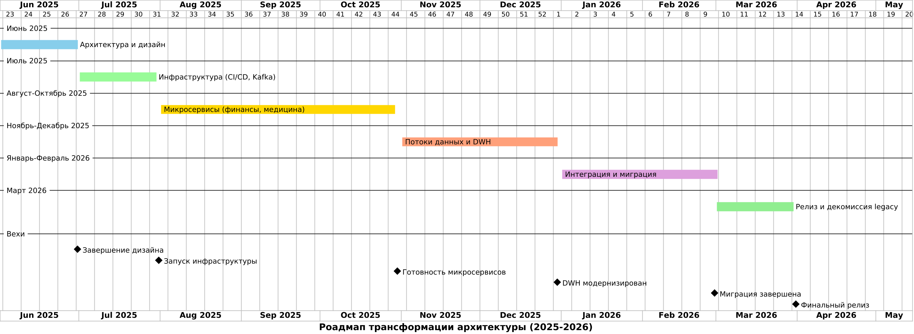

### Роадмап трансформации архитектуры

Для реализации изменений разработан подробный **роадмап** на год, разбитый на этапы. Ниже представлена диаграмма дорожной карты с основными этапами и их временными рамками (условно, с начала июня 2025 до мая 2026). 
Каждый этап включает результаты, ответственные команды и необходимые ресурсы:

---

**Этап 1: Детализация архитектуры и дизайн доменов (Июнь 2025).** На этом этапе архитектурная команда совместно с ведущими разработчиками и бизнес-аналитиками уточняет **границы доменов**, описывает состав микросервисов, их ответственность. Создаются C4-диаграммы компонентов, разрабатывается **контекстная карта** (context map) взаимодействия доменов. 
* **Результат этапа** – **архитектурный план**: описаны все будущие сервисы, выбраны технологии (например, принято решение использовать Kubernetes, Kafka, обновить SQL и т.д.), определены команды и владельцы для каждого домена. Также составлен план обучения команд новым технологиям (тренинги по DDD, Kafka, Kubernetes).
* **Ресурсы:** время архитекторов, консультации экспертов (возможно, привлечён внешний DDD-коуч), небольшая инфраструктура для прототипирования.
* **Команды:** архитектурный комитет, лидеры команд разработки.
  

> *Обоснование:* Этот этап крайне важен – **планирование и дизайн**. Он закладывает фундамент, чтобы дальнейшая реализация не пошла хаотично. Согласно лучшим практикам, прежде чем дробить монолит, нужно понять границы контекстов и пути миграции. Инвестирование месяца в дизайн сэкономит время на переделках. Здесь же решаются стратегические вопросы: что делать с DWH (выбрана цель – обновление vs миграция), как обеспечивать безопасность (политики доступа для каждого домена), как организовать DevOps. Без четкого плана высок риск, что параллельные команды пойдут разными курсами и интеграция затянется.

---

**Этап 2: Подготовка инфраструктуры (Июль 2025).** Выделенная **DevOps/Platform команда** разворачивает необходимую инфраструктуру для будущей системы. Это включает: настройку **CI/CD конвейера** (например, GitLab CI или Jenkins, создание репозиториев для микросервисов, шаблонов pipeline), разворачивание **контейнерной платформы** (Kubernetes-кластера) и Docker Registry, внедрение **Kafka** (развёртывание брокеров, настройка топиков по доменам), а также сопутствующих сервисов (система логирования, мониторинг). Параллельно, на этом этапе проводится контейнеризация текущего приложения в минимальном виде – чтобы протестировать CI/CD и инфраструктуру на существующем коде. 

* **Результат этапа:** готовый дев/тест контур новой платформы – разработчики могут деплоить простейшие сервисы через новый пайплайн, Kafka проходит тестирование (тестовые сообщения между сервисами).
* **Ресурсы:** потребуется аренда или закупка серверов/виртуалок для Kubernetes и Kafka (если облако – то настройки в облаке), лицензии или настройка open-source инструментов.
* **Команды:** DevOps-инженеры, системные администраторы, при участии лидеров разработки (чтобы настроить pipeline под их проекты).

> *Обоснование:* Инфраструктурный этап – это **фундамент для быстрой и безопасной разработки**. Без заранее настроенного CI/CD и оркестрации микросервисная модель может ухудшить ситуацию (множество сервисов сложно управлять вручную). Потому этот этап выделен ранним: пока разработчики проектируют сервисы, параллельно создаётся окружение, где эти сервисы будут запускаться. В итоге к началу активной разработки (этап 3) команды уже получат инструменты для эффективной работы (репозиторий, автосборка, среда для деплоя). Кроме того, сразу внедряется Kafka, чтобы далее строить обмен событиями по готовой шине. Такой подход минимизирует **технические риски** – все новые технологии опробуются на ранней стадии.

---

**Этап 3: Реализация микросервисов ядра (Август–Октябрь 2025).** На этом этапе несколько команд параллельно начинают разработку основных микросервисов в каждом домене. Приоритет – **ключевые сервисы финансового и медицинского доменов**, которые обеспечивают существующий базовый функционал (чтобы можно было вывести монолит из эксплуатации). Например, команда финдомена реализует `Payment Service` и `Billing Service` с нуля (или выносит из монолита), команда меддоменa – `EMR Service` и т.д. Пишутся необходимые API, логика, подключаются собственные базы данных. Также разрабатываются **интеграционные адаптеры**: временные модули, которые синхронизируют данные между старой системой и новыми сервисами, чтобы обеспечить целостность на период миграции (например, двусторонняя синхронизация ключевых таблиц). К концу этапа имеется набор микросервисов, проходящих внутреннее тестирование, и реализовано взаимодействие между ними через Kafka или REST там, где это нужно. Например, платежный сервис публикует событие «PaymentCompleted» в Kafka, и сервис биллинга его ловит и формирует счет. 
* **Результат:** **бета-версия** новой микро-сервисной системы, покрывающая \~60-70% функционала монолита (без аналитики).
* **Ресурсы:** интенсивная работа разработчиков (возможно, расширение штата или привлечение подрядчиков, чтобы параллельно покрыть все направления). Необходимо обучать команду по ходу (менторинг по Kafka, best practices микросервисов).
* **Команды:** к этому времени сформированы 2–3 кросс-функциональные команды (FinTech, Med, возможно AI) + продолжает работу платформа/DevOps команда для поддержки.

> *Обоснование:* Этот этап – **ядро трансформации**, собственно разработка. Вынос функционала из монолита в микросервисы оправдан, поскольку позволит решить главные проблемы: ускорить релизный цикл и улучшить масштабируемость. Здесь применяются принципы, заложенные на этапе 1 (DDD) – каждая команда строго реализует свой контекст, что предотвращает хаотичную разработку. Параллельная работа нескольких команд стала возможна благодаря этапу 2 (инфраструктура готова, они не ждут друг друга при деплое). Включение интеграционных адаптеров (шлюзов к старой системе) – критично, чтобы **обеспечить постепенную миграцию**. Бизнес сможет работать бесперебойно: старый монолит еще функционирует, но уже подключены новые сервисы, и часть трафика/данных идёт через них (например, новые пользователи могут создаваться сразу в новом сервисе). Этот этап дает огромное количество новых возможностей, но и несет риски (несовершенство первой версии сервисов). Поэтому он длится несколько месяцев с итеративным тестированием и улучшением сервисов.

---

**Этап 4: Внедрение потоков данных и модернизация DWH (Ноябрь–Декабрь 2025).** После того как основные микросервисы созданы, фокус смещается на **аналитический контур и данные**. Проводится **модернизация DWH**: разворачивается новая версия SQL Server или мигрируется база в облако, переносится схема данных. Настраиваются процессы загрузки в DWH из новых микросервисов. Например, вместо того чтобы DWH получал данные из старой БД, настраивается потребление событий Kafka и их трансформация в модели хранилища (с использованием Apache Camel, Kafka Streams или ETL-инструмента). Обязательно внедряется **анонимизация**: разрабатываются скрипты или сервис, который обрабатывает чувствительные поля (имена пациентов, идентификаторы) – либо на этапе публикации события, либо при загрузке в DWH – чтобы в хранилище не попадали PHI (защищенные данные). Также, параллельно, реализуются **AI/ML-сервисы**: если, например, в планах был сервис скоринга рисков, к концу этого этапа должна быть готова его модель и API интеграция с финдоменом. 
* **Результат:** обновленное DWH, заполненное из микросервисов (идет двусторонняя параллель: старый DWH тоже ещё получает данные, но новый уже наполнен историей за период тестирования). BI-отчеты перенастроены на новый DWH (или на ту же структуру, но на обновленном сервере). Сервисы AI интегрированы: например, платежный сервис при транзакции дергает AI-сервис для скоринга, и результат используется сразу.
* **Ресурсы:** потребуется лицензирование нового SQL или инфраструктура (кластеры, хранилища). Возможно, услуги консультантов по миграции данных (перенос больших объемов истории, настройка репликации).
* **Команды:** Data Engineering/BI команда для DWH, совместно с командой меддоменa (для анонимизации) и финдоменa (для валидности данных). Команда AI/ML для развёртывания моделей.

> *Обоснование:* В предыдущих этапах упор был на транзакционные сервисы. Однако ценность данных и аналитики не меньше – поэтому Этап 4 посвящен **данным и интеллекту**. Обновление DWH убирает техдолг (старую версию SQL), что обязательно для поддержки. Одновременно, интеграция DWH с микросервисами через события – ключевой шаг для устранения «ручных» или устаревших ETL. Он обеспечивает более оперативную аналитику и гарантирует, что DWH получает все новые данные без участия монолита. Реализация же анонимизации на этом этапе закрывает **вопрос соответствия нормам**: к моменту запуска новой системы все процедуры защиты данных уже отлажены, что снижает регуляторные риски. Внедрение AI-сервисов именно сейчас логично, поскольку у нас уже есть более-менее стабильные данные в новых сервисах и налажен обмен – AI-команда может взять реальные потоки данных для обучения моделей. Это позволит к моменту запуска системы иметь готовые интеллектуальные функции, что даст бизнесу быстрый выигрыш (например, автоматизированная аналитика, которой раньше не было). В итоге, этап 4 готовит **аналитическую экосистему**, соответствующую новой архитектуре.

---

**Этап 5: Тестирование интеграции и миграция пользователей (Январь–Февраль 2026).** Когда разработаны все ключевые части, настает время **комплексного тестирования** и плавного переноса на новую архитектуру. Проводится тщательное **end-to-end тестирование**: проверяются все бизнес-процессы сквозь новые микросервисы, корректность данных в DWH, работа отчетов, совместимость AI-результатов. Также выполняется **нагрузочное тестирование** новой системы (чтобы убедиться, что Kafka выдерживает поток событий, Kubernetes – нагрузку от микросервисов, и т.д.). Выявленные дефекты оперативно исправляются. Параллельно осуществляется **поэтапная миграция пользователей/запросов** на новую систему: например, часть трафика перенаправляется через API Gateway к микросервисам, тогда как остальной все еще обслуживается старым приложением. Такой «канареечный» подход позволяет проверить систему на реальных пользователях постепенно. К концу этапа все или почти все пользователи работают через новую архитектуру, монолитный компонент находится в режиме "только-чтение" (не принимает новых данных). Кроме того, проводится обучение персонала (администраторов, support-специалистов) работе с новой системой, новыми инструментами мониторинга. 
* **Результат:** **система в релизной готовности**, подтверждена корректность работы, пользователи не испытывают проблем. Можно принимать решение о полном переключении.
* **Ресурсы:** тестовые среды, возможно, дополнительная арендованная инфраструктура для нагруженных тестов. Вовлеченность бизнес-пользователей для приемочного тестирования (особенно BI-отчетов) – их время и обратная связь.
* **Команды:** все команды вместе – этап требует координации (встречи по интеграции). QA-инженеры проводят тест-дизайн и автоматизацию сценариев. DevOps настраивают возможность blue-green/canary релизов.

> *Обоснование:* Этот этап критичен для **снижения рисков при запуске**. Архитектура существенно изменилась, и важно убедиться, что ни один бизнес-процесс не нарушен. Тестирование интеграции выявляет проблемы взаимодействия между сервисами, которые могли быть не видны на уровне unit-тестов. Нагрузочные тесты подтверждают нефункциональные требования – система должна выдержать хотя бы ту же нагрузку, что и старая, а лучше с запасом. Плавная миграция пользователей – ключевой прием DevOps, позволяющий избежать полного отключения и отката. Например, можно сначала переключить 10% пользователей на новый контур (фичи-флагами или DNS), и при успехе наращивать процент. Это обеспечивает **безопасность развертывания**: при сбоях всегда есть возможность временно вернуть трафик на монолит. Также, обучение команд эксплуатации гарантирует, что после релиза не возникнет ситуации «система новая, никто не знает, как она работает». В сумме, этап 5 обеспечивает уверенность стейкхолдеров, что можно выключить старую систему.

---

**Этап 6: Релиз целевой архитектуры и декомиссия legacy (Март 2026).** Финальный этап – **полный переход** на новую архитектуру. Он начинается с принятия решения Go-Live: после успешных тестов и миграции большей части нагрузки, руководством проекта даётся «зеленый свет». Производится **полное переключение**: все пользователи и данные направляются в новые микросервисы, старый монолит отключается от продакшена. В первые дни/недели после переключения команды находятся в режиме повышенной готовности (мониторят метрики, быстро реагируют на инциденты). Если возникают проблемы, они устраняются оперативно в микросервисах (благо, их можно перекатить отдельно). После стабилизации работы начинается процесс **декомиссии legacy-систем**: архивируются данные из старой базы, высвобождаются серверы, отключаются лишние интеграции. Завершается этап подведением итогов: сравнение KPI до/после (например, время отклика системы, частота релизов, удовлетворенность пользователей). *Результат:* новая архитектура «Будущее 2.0» функционирует в полном объеме, достигнуты целевые показатели (микросервисная архитектура на всех слоях). Документация обновлена, ответственность передана от проектной команды в режим операционного сопровождения. *Ресурсы:* последние ресурсы на поддержку (например, контракты с вендорами на поддержку Kubernetes, если нужно). Небольшой резерв бюджета на непредвиденные доработки в момент релиза. *Команды:* все разработчики, DevOps и тестировщики – на боевом дежурстве при запуске; команда поддержки – принимает дела.

> *Обоснование:* В этом этапе происходит то, ради чего всё затевалось – **финальное получение пользы**. Микросервисная архитектура начинает приносить плоды: можно делать независимые релизы сервисов (что раньше было невозможно), при росте нагрузки – быстро масштабировать нужный сервис, а не всю систему. Бизнес сразу замечает повышение скорости изменений – вместо ожидания следующего релиза монолита, новые функции выкатываются хоть каждые день/неделю. Отдельно стоит отметить: отключение старого DWH/СУБД устраняет риски, связанные с его поддержкой (например, необходимость ставить платные расширенные патчи – теперь не нужно). Также, наконец, устраняется проблема, что **логика частично была вне контроля** – теперь всё внедрено в код микросервисов, который версионируется, тестируется. В плане безопасности и соответствия: применены современные методы защиты, минимизирован круг лиц, имеющих доступ к персональным данным (только сервисы меддоменa). В итоге, на этапе 6 организация получает **обновленную, гибкую ИТ-платформу**, готовую к будущему росту.

